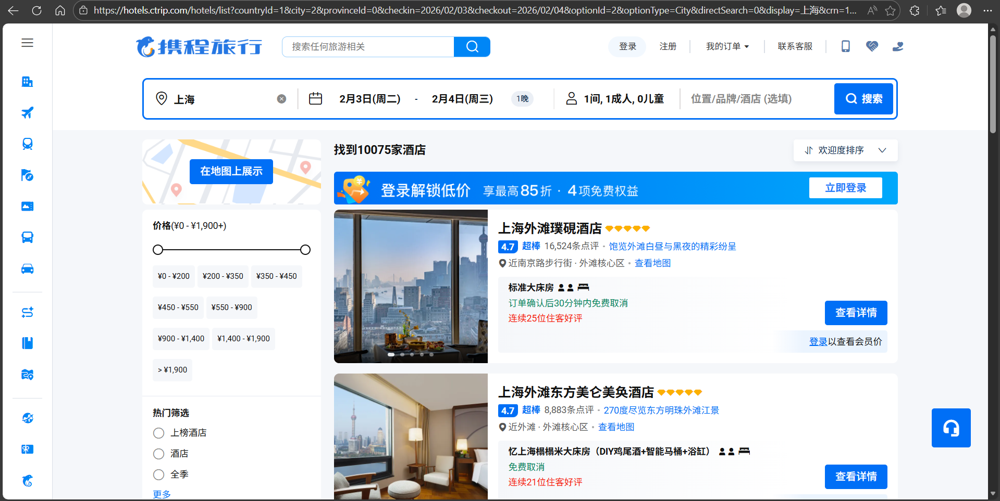
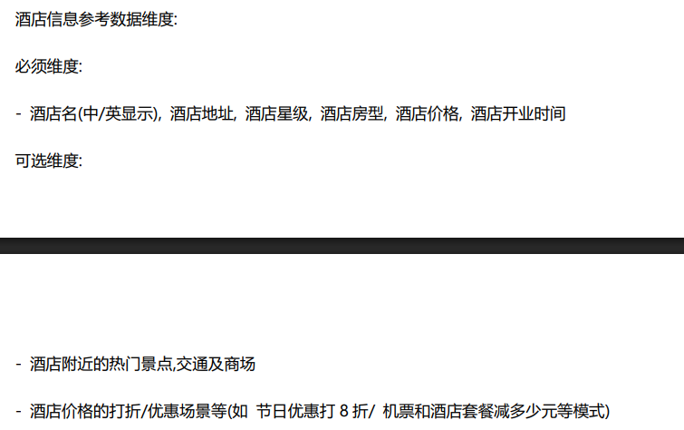
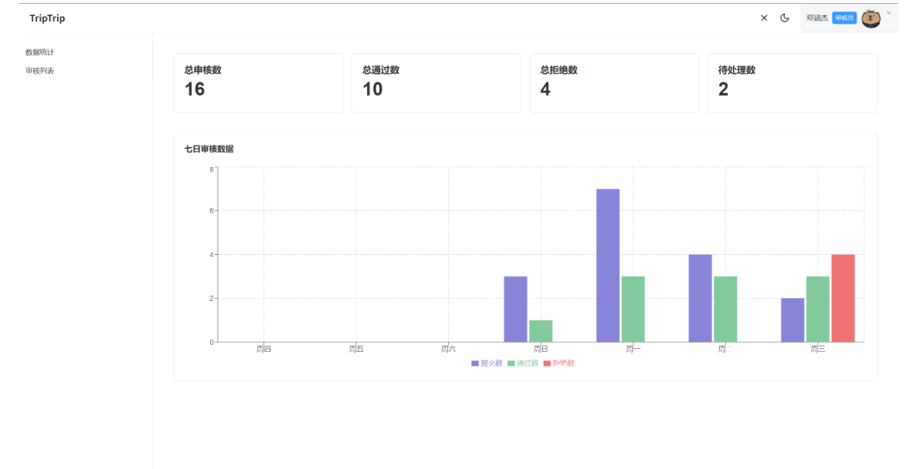
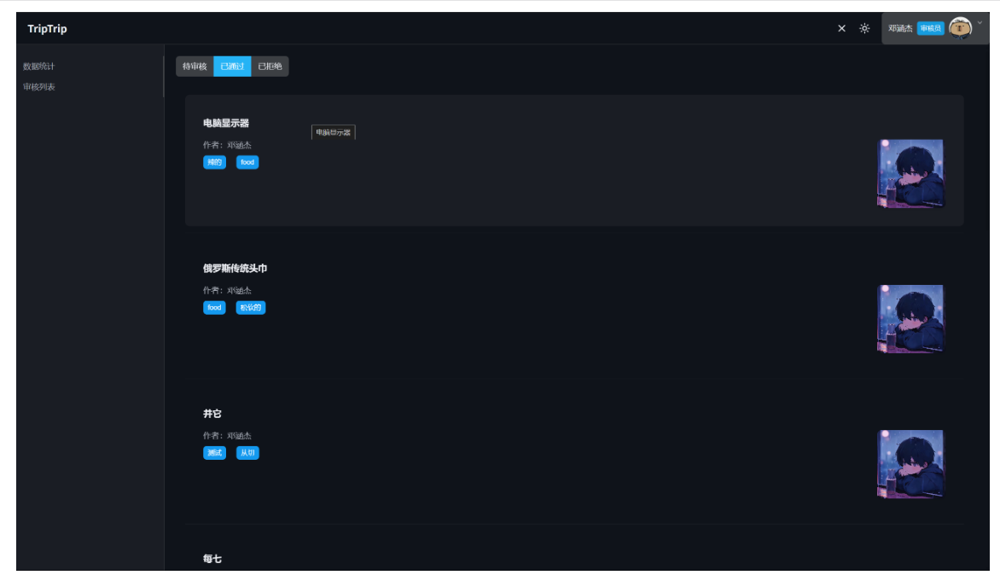

# 携程大作业

## 用户端

### 酒店查询页

仅考虑易宿，顶部的单搜索框和左侧的功能栏可以不用。中部的搜索栏支持地区、酒店名、级别、日期筛选，搜索跳转酒店列表。
右侧轮播图在全项目完成后可以考虑开发。
下部酒店推荐放一些默认搜索条件下的酒店页面即可。

### 酒店列表页

在地图上显示的功能建议不做。
上部搜索栏继承首页已输入的搜索条件，支持实时修改重新查询。
左侧增加价位、房型、酒店设施等二次筛选。
右侧为酒店列表，搜索跳转酒店页面。是否添加多排序方式待定。

### 酒店详情页

顶部搜索栏保留。
插入酒店图片。图片由服务端上传。图片下方是酒店简介。

再往下的部分，鉴于短期开发，可以考虑就用酒店简介替代。

## 管理系统

### 用户注册

注册分为验证手机和设置密码两步，对用户名和密码加以限制，同时注册选择管理员or商户

### 用户登录

### 商户

#### 上传酒店

根据需求的信息上传

#### 编辑酒店

### 管理员

以管理员身份登入后，有数据统计和审核列表两个功能，在导航栏切换，右上角显示用户名及头像，点击可查看个人信息

#### 审核

审核包括待审核、已通过和已拒绝，可以看到每一个具体酒店的名称、图片和上传用户

#### 发布

审核界面包括通过和不通过两个选项，选择不通过后弹出下拉选择框以及文本框，选择或描述不通过的原因

#### 下线

已通过的界面增加搜索栏，对酒店名称进行搜索，可以根据名称选择酒店下线，在下拉选择框以及文本框选择或描述下线的原因